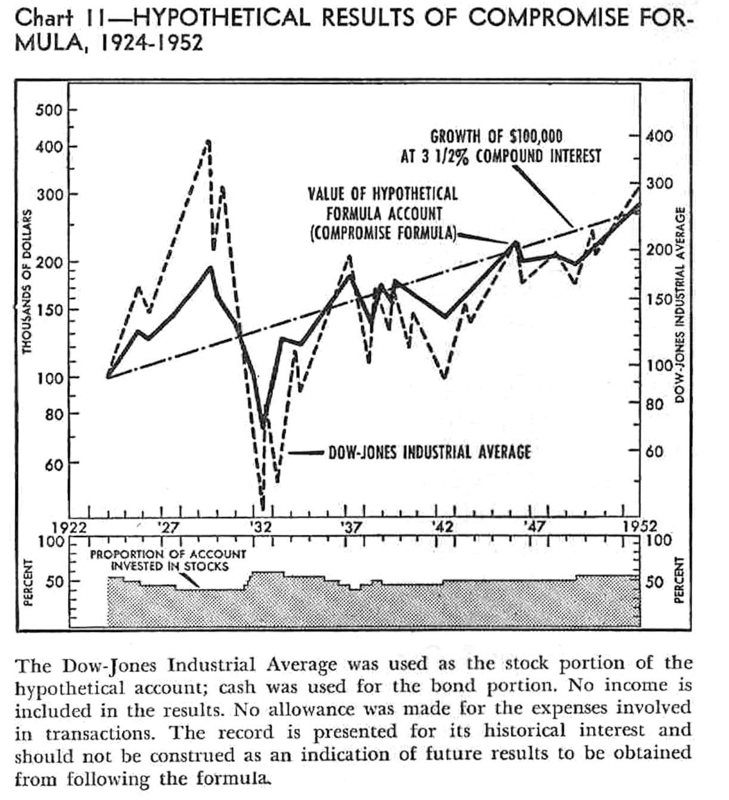

```{r setup, include=FALSE}
knitr::opts_chunk$set(echo = TRUE)
```

# Abstract

> Minimum investment returns are of primary importance to funding retirement expenses from an investment portfolio. Prolonged periods of low yields have at times had severe effects on minimum 20-year returns. Is there a strategy that can mitigate weak medium-term returns more effectively than fixed-percentage stock allocations?
>
> Benjamin Graham allowed for fluctuation in the proportion of a portfolio invested in common stock.
> Considering his "Margin of Safety" principle for stock purchases and its complement for stock sales, one might adjust the stock percentage of the portfolio based on both the stock earnings yield and the current yield for bonds, facilitating capital appreciation by avoiding trading until the present yield of the purchased security is substantially greater than that of the sold security.
> It may be wise to add a hedge against stock prices in excess of historically sustainable levels.
>
> For 20-year intervals since 1911, when allocating between 10-year US Treasury bonds and the S&P 500 index, a simple formula implementing such a "Yield-Based Asset Ratio" hypothetically would have had a *minimum* compound annual growth rate (CAGR) of 1.92%, considerably higher than would have been observed for 6%, 60%, and 85% stock allocations (CAGR -2.33%, -0.41%, and 0.09%, respectively). Results suggest that a fixed-percentage stock allocation may not offer the best protection of retirement income for interval lengths of 11 or more years.

**Abbreviations and symbols**

- *CAGR*: compound annual growth rate
- *CAPE*: cyclically-adjusted price-to-earnings ratio
- *GS10*: ten-year US Treasury bonds
- *P/E10*: synonym "CAPE", i.e., SP500 price divided by annual earnings averaged over ten years
- *SP500*: the S&P 500 stock index
- *YBAR*: yield-based asset ratio

# Introduction

A retirement may last forty years or more; funding it requires a decumulation strategy that both supports ongoing spending and resists market downturns.  Although returns from aggressive investments may offer modest opportunities to increase funding for longer-term expenses, incurring losses at unfavorable times when funding near-term spending from the retirement portfolio may threaten principal that is earmarked to generate income for the distant future.^[Pfau, Wade D., 2023. *Retirement Planning Guidebook: Navigating the Important Decisions for Retirement Success.* Retirement Researcher Media. ISBN-13: 978-1-94-564015-5. [https://retirementresearcher.com/books/](https://retirementresearcher.com/books/)] In the near term, minimally volatile assets, insurance products (e.g., annuities), or buffer assets (e.g., home equity conversion mortgages) may be the retiree's best recourse to mitigate the risk that "market underperformance" poses to funding retirement successfully.^[*Ibid.*] Volatile assets can only be wisely dedicated to funding intermediate-term and long-term spending needs, but one must decide how to allocate investments among volatile assets.

Current conventional wisdom posits that a fixed-percentage stock allocation can provide a fair-to-good balance between returns and risk of loss (depending on the percentage chosen), but how reliable is that balance in the intermediate term, e.g., over 20 years? Historically, during protracted intervals when stock yields were generally low, fixed-percentage stock allocations neither buffered stock-market price declines dramatically nor provided income efficiently.

For example, total real returns for the Standard & Poor's 500 stock index (SP500) were painfully low over 20-year intervals starting in 1912, 1929, and 1961, and they were barely competitive with bonds over 1988–2008. One may argue that September 1961 started the worst 20-year interval since 1911 because, between 1969 and 1981, real returns from both SP500 and 10-year US Treasury bonds (GS10) were so minimal that SP500 had real growth of only 7% over the entire twenty years starting March of 1962 (compound annual growth rate, CAGR: 0.34%), while GS10 lost 33% of its real value (CAGR: –1.98%); portfolios having a fixed-percentage stock allocation would have performed between these rates of return.

## Historical perspective

Are stocks a prudent investment at any time?
Edward McQuarrie writes:

> US investors must accept that stocks will not always beat bonds, no matter [the length of] the holding period. ... Two centuries [of data] are sufficient to undermine the idea that an advantage of stocks over bonds, of +2% to +4% annualized,  represents any kind of lawful regularity or any range to which values must quickly revert."^[McQuarrie, Edward F., 2023. *Stocks for the Long Run? Sometimes Yes, Sometimes No.* Financial Analysts Journal, [DOI: 10.1080/0015198X.2023.2268556](https://dx.doi.org/10.1080/0015198X.2023.2268556).]

Benjamin Graham urged investors to avoid paying too much for stocks (lest the cost basis erode the gains substantially), suggesting that investors set "an upper limit of purchase price at 25 times average earnings of the past seven years"^[Benjamin Graham, 2003. *The Intelligent Investor -- Revised edition, updated with new commentary by Jason Zweig.* Harper Collins. [https://lccn.loc.gov/2003047894](https://lccn.loc.gov/2003047894), p. 159.]; at this limit, the "earnings yield" (annual earnings divided by price) would be 4%.
Robert Shiller defined an analogous "Cyclically Adjusted Price to Earnings Ratio" (CAPE), wherein earnings are averaged over the previous ten years rather than seven, and related it to "price bubbles" in the S&P 500 stock index.^[Robert J. Shiller, 2016. *Irrational Exuberance.* Princeton University Press. [https://lccn.loc.gov/2014036705](https://lccn.loc.gov/2014036705).] The CAPE is also commonly known as the "P/E10 ratio" or "the Shiller PE ratio".
William Bernstein noted (and interpreted) a gradually increasing trend in the P/E10,^[Bernstein, William J., 2013. The Paradox of Wealth and the End of History Illusion. Efficient Frontier Advisors.
[https://citeseerx.ist.psu.edu/document?repid=rep1&type=pdf&doi=2bb45f3324df5b05c4764f135cfea7ad37f78b33](https://citeseerx.ist.psu.edu/document?repid=rep1&type=pdf&doi=2bb45f3324df5b05c4764f135cfea7ad37f78b33).  His interpretation: "Both theory and long-run empirical data support the notion that economic growth lowers security returns."] as illustrated in Figure 12 in the Appendix.

Graham weighed the value of stock investments against the alternative of investing in bonds:

 > A reasonably sound central value, or intrinsic value, of the Dow-Jones list can be ascertained by capitalizing the average earnings for the past ten years on a basis equivalent to twice the yield of high-grade bonds.^[Benjamin Graham, 1959. *The Intelligent Investor: a book of practical counsel*, second revised edition. Harper. [https://lccn.loc.gov/59009946](https://lccn.loc.gov/59009946), p. 267.]

Graham generalized this in his "margin of safety" principle:

> The function of the margin of safety is, in essence, that of rendering unnecessary an accurate estimate of the future. If the margin is a large one, then it is enough to assume that future earn- ings will not fall far below those of the past in order for an investor to feel sufficiently protected against the vicissitudes of time. ...
> In the ordinary common stock, bought for investment under normal conditions, the margin of safety lies in an expected earning power considerably above the going rate for bonds.^[Graham, 2003. *Op. cit.*, pp. 512--524.]

Graham did not insist that the ratio of stocks to bonds in a portfolio be invariant under all circumstances:

> The program I propose with 25 percent of the portfolio in stocks and 25 percent in bonds, allowing the other 50 percent to fluctuate in accordance with the market, could be operated pretty well over the future, whether the business cycle is under better control or not.^["Benjamin Graham: Thoughts on Security Analysis" [transcript of lecture at the Northeast Missouri State University business school, March, 1972], Financial History, no. 42, March, 1991, pp. 8--10 and 28--29. [https://archive.org/details/friendsoffinanci00rmsm_38/page/8/mode/2up ](https://archive.org/details/friendsoffinanci00rmsm_38/page/8/mode/2up).]

In 1953, Lucille Tomlinson investigated an "investment formula" based on Graham's "central value" to explore the hypothetical results of varying the percentage of a portfolio invested in stocks from the Dow-Jones index, showing that, for 1924--1952, such a portfolio would have performed comparably to stocks with somewhat less volatility.^[Lucile Tomlinson, 1953. *Practical Formulas for Successful Investing.* Wilfred Funk, Inc.. [https://lccn.loc.gov/53005696](https://lccn.loc.gov/53005696), pp. 192--193, 232--238.]
See Figure 11 in the Appendix for an illustration of her results.

Today, it is possible to test hypothetical results with much more data.
Robert Shiller maintains an historical record, since 1871, of the price, earnings, dividends, and total returns of the spliced equivalent of the S&P 500 index (SP500), the interest rate and total returns of ten-year US Treasury bonds (GS10), and the spliced equivalent of the Consumer Price Index (CPI, which is the basis of inflation reports seen in the press).^[[http://www.econ.yale.edu/~shiller/data/ie_data.xls](http://www.econ.yale.edu/~shiller/data/ie_data.xls), the composition of which is described at [http://www.econ.yale.edu/~shiller/data.htm](http://www.econ.yale.edu/~shiller/data.htm).]

Since 1911, earnings yields for stocks and (nominal) interest for 10-year government bonds have been weak estimators of their respective 10-year real returns:

- There has been a 58% correlation between SP500 earnings yield (estimated as E10/P) and the subsequent ten-year real return.^[See Figure 9 in the Appendix. This relationship was discussed by Bogleheads user Siamond at [https://www.bogleheads.org/blog/2018/02/28/cape-and-safe-withdrawal-rates/](https://www.bogleheads.org/blog/2018/02/28/cape-and-safe-withdrawal-rates/).]
- There has been a 64% correlation between the nominal interest rate yield for GS10 and its subsequent ten-year real return.^[See Figure 10 in the Appendix.]
- Such levels of correlation are expected to occur by random chance less than 20% of the time.^[The "Fisher transformation" maps distribution of the correlation coefficient to a normal distribution. See, e.g.: [https://en.wikipedia.org/wiki/Fisher_transformation](https://en.wikipedia.org/wiki/Fisher_transformation).]

## Boosting the minimum 20-year return of an investment portfolio

This paper presents a Yield-Based Asset Ratio (YBAR) investment formula:

- This formula specifies for a portfolio dynamic minimum and maximum limits on the percentage of stock.
  - These limits vary both with the present nominal yield of ten-year US Treasury bonds and with the earnings yield of the S&P 500 stock index.
- The YBAR hypothetically would had a 1.92% CAGR for the 20 years beginning in September of 1961.
- This formula's gain over all 20-year periods since 1911 would have had a minimum that was substantially higher than minima for a 6% stock, 60% stock, or 85% stock portfolio.

With respect to minimum returns for an intermediate-term time horizon (20 years or longer), the performance of this YBAR formula compares favorably (in hypothetical tests) to allocation methods specifying a fixed percentage of stock in a portfolio.
This formula and its parameters were developed and tested using the historical record since 1911, which is both a short interval from a statistical sampling perspective and a long interval with respect to what might constitute "the modern era".
This formula is conjectural at best, yet, in Graham's words:

> If you cannot base your investment policy on the past, I think you have no basis for it at all.^["Benjamin Graham: Thoughts on Security Analysis". *Op. cit.*] 

```{r echo=FALSE, results='asis'}
cat("\n\\newpage\n")
```

# A YBAR-based investment formula

What follows is a template for an investment formula (i.e., a set of decision rules) utilizing a YBAR to allocate between the S&P 500 index and ten-year US Treasury bonds:

- Initially, establish minimum and maximum stock percentages that vary with SP500 earnings yield and nominal GS10 current yield.
- Buy stock incrementally (to reach the minimum percentage) as the stock percentage falls below the minimum percentage -- 6%; this is a practical utilization of Graham's "margin of safety".
- Sell stock incrementally (to reach the maximum percentage) as the stock percentage exceeds the maximum percentage + 6%; this reflects the "margin of folly", defined below.
- When stock prices are very high, apply a cap to the stock percentage; this respects the "margin of reversion", defined below.
- Do not trade stock otherwise.

## Margin of Safety

Graham's margin of safety may be expressed in percentage terms as:
  $$
  \textbf{margin of safety} = 100\% \times \frac{(\text{stock earnings yield}) - (\text{bond current yield})}{\text{bond current yield}}
  $$
Graham presented this as a generally useful guiding principle to apply during a decision whether to purchase stock, not as a precise trading indicator. It is an intuitive but ultimately arbitrary construction. 

## Margin of Folly

One may introduce a companion term, "margin of folly", where bond yields are high enough to make it folly to hold much stock:

  $$
  \textbf{margin of folly} = 100\% \times \frac{(\text{bond current yield}) - (\text{stock earnings yield})}{\text{stock earnings yield}}
  $$
This is as intuitive and arbitrary as the margin of safety.

## Margin of Reversion

Another companion term, "margin of reversion", reflects how stock earnings yield stands relative to historical expectation:
  $$
  \textbf{margin of reversion} = 100\% \times \frac{(\text{historically expected stock earnings yield}) - (\text{stock earnings yield})}{\text{stock earnings yield}}
  $$
The retiree may wish to consider this potential "reversion volatility" that as they contemplate funding their retirement from whatever remains in their portfolio.

```{r echo=FALSE, results='asis'}
cat("\n\\newpage\n")
```

**Illustration of margins of safety and folly**

Contour lines corresponding to several fixed levels of the margins of safety and folly for typical stock and bond yields are shown in Figure 1.

```{r echo=FALSE, out.width=400, fig.align='center', fig.cap='Levels of margins of safety and folly for selected stock and bond yields'}
knitr::include_graphics("img/margins_of_safety_and_folly.pdf")
```
```{r echo=FALSE, results='asis'}
cat("\n\\newpage\n")
```

## Formula inputs

The inputs used to compute the minimum and maximum stock percentages for the YBAR exemplified in this paper are as follows:

  - \(\textbf{B}\) = current nominal yield for GS10 (10-year Treasuries);
    - e.g., look
this up at [*https://multpl.com/10-year-treasury-rate*](https://multpl.com//10-year-treasury-rate).
  - \(\textbf{D}\) = greatest allowable deviation of stock percentage beyond the minimum or maximum stock percentage limits before the corresponding limit must be enforced.
    - This paper uses 6%.
  - \(\textbf{H}\) = maximum hazard, i.e., the maximum tolerable <i>unrealized</i> loss
when the price of SP500 declines to the statistically expected level;
    - e.g., adjust according to risk appetite; this paper uses 25%.
    -  Such loss would be realized *only* when an investor is forced to sell at a loss.
  - \(\textbf{Mi}\) = minimum acceptable percentage of stock in the portfolio;
    - although Graham suggested 25%; this paper uses 6%.
  - \(\textbf{Ma}\) = maximum acceptable percentage of stock in the portfolio;
    - although Graham suggested 75%; this paper uses 85%.
  - \(\textbf{S}\) = earnings yield on SP500 (S&amp;P 500 index);
    - e.g., look up the Shiller PE (the P/E10) at [*https://multpl.com/shiller-pe*](https://multpl.com/shiller-pe) and take the reciprocal:
$$
\boxed{ \textbf{S} = \frac{1}{\text{P/E10}} }
$$
  - \(\textbf{T}\) = 4.14%, the average nominal current yield for GS10 since 1911.^[The formula is not sensitive to this parameter; increasing \(\textbf{T}\) to 6.5% has little impact on the formula's performance.]
  - \(\textbf{X}\) = the "expected P/E10",^[John Tukey's "median-median line" (via the R `line` function, [https://search.r-project.org/R/refmans/stats/html/line.html](https://search.r-project.org/R/refmans/stats/html/line.html)) was used to estimate expected P/E10 rather than a least squares line because distribution of the P/E10 deviates considerably from normality. This is shown in Figure 12 in the Appendix.] computed as:
$$
  \boxed{ \textbf{X} = (\text{date in years}) \times 0.058784736 - 97.431912 }
$$
    - e.g., \( \textbf{X} = 21.54 \) for January 2024.

```{r echo=FALSE, results='asis'}
cat("\n\\newpage\n")
```
## Yield-based limits on stock percentage

Three expressions are computed from the inputs above.

### Reversion cap on stock percentage

The first expression, upon which other two depend, specifies a "reversion cap", an upper limit for the stock percentage; this reflects the margin of reversion.

$$
\boxed{
   \textbf{Cap(S, H, X)} = \frac{ \textbf{H} \times \textbf{S} \times \textbf{X}}{ max \Big( \textbf{H} \times \textbf{S} \times \textbf{X}, 1 - (\textbf{S} \times \textbf{X}) \Big) }
  }
$$

### Minimum stock percentage limit

The minimum stock percentage, which reflects the margin of safety, is given by:

$$
\boxed{
    \textbf{MinStockPercent(S, B, H, Ma)}
    = min\Bigg(
      {\small \textbf{Cap(S, H, X)}},
      \textbf{Ma},
      max\bigg(
        0,
        {\small \frac{2 \times \textbf{B}}{\textbf{T}} }
        \times
        \Big( {\small \frac{\textbf{S}}{\textbf{B}}} - 1 \Big)
      \bigg)
    \Bigg)
}
$$

One would buy stock to reach this minimum percentage once the actual percentage of stock in the portfolio falls to $\textbf{MinStockPercent(S, B, H, Ma)} - \textbf{D}$.

The factor $\frac{2 \times \textbf{B}}{\textbf{T}}$ was deduced from performance of the formula since 1911 to capture effectively opportunities for capital appreciation of stocks.

### Maximum stock percentage limit

The maximum stock percentage, which reflects the margin of folly, is given by:

$$
\boxed{
    \textbf{MaxStockPercent(S, B, H, Ma, Mi)}
    = min\Bigg(
      {\small \textbf{Cap(S, H, X)}},
      \textbf{Ma},
      max\bigg(
        Mi,
        1 - {\small \frac{3 \times \textbf{B}}{\textbf{T}} }
        \times
        \Big( {\small\frac{\textbf{B}}{\textbf{S}}} - 1 \Big)
      \bigg)
    \Bigg)
}
$$

One would sell stock to reach this maximum percentage once the actual percentage of stock in the portfolio rises to $\textbf{MaxStockPercent(S, B, H, Ma)} + \textbf{D}$.

The factor $\frac{3 \times \textbf{B}}{\textbf{T}}$ was deduced from performance of the formula since 1911 to capture effectively opportunities for avoid depreciation of stocks.

```{r echo=FALSE, results='asis'}
cat("\n\\newpage\n")
```

Figure 2 illustrates these maximum and minimum stock percentage limits when the current yield for GS10 ($\textbf{S}$) is 4.14% (i.e., $\textbf{T}$).

```{r echo=FALSE, out.width=400, fig.align='center', fig.cap='Minimum and maximum stock percentage for bond current yield of 4.14%. Solid red line represents minimum stock percentage. Dashed blue line represents maximum stock percentage.  Dotted red line represents the deviation beyond the minimum stock percentage that triggers stock purchase. Dotted blue line represents the deviation beyond the maximum stock percentage that triggers stock sale.'}
knitr::include_graphics("img/fig2_boundaries_mos.pdf")
```

```{r echo=FALSE, results='asis'}
cat("\n\\newpage\n")
```

Figure 2 presented the limits when current yield of GS10 (i.e., $\textbf{B}$) is 4.14% (i.e., $\textbf{T}$). However, the limits change with variation in $\textbf{B}$ or $\textbf{S}$. The next two figures relate contour lines (along each of which the level of the limit is constant) to both $\textbf{B}$ and $\textbf{S}$.

The contour lines in Figure 3 illustrate five levels of minimum stock percentage over selected ranges of bond current yields and stock earnings yields.
Contours become vertical where parameter \(\textbf{H}\) limits the reversion hazard.

```{r echo=FALSE, out.width=400, fig.align='center', fig.cap='Minimum stock percentage contours for selected ranges of bond current yield and stock earnings yield.'}
knitr::include_graphics("img/min_stock_proportion_mos.pdf")
```

```{r echo=FALSE, results='asis'}
cat("\n\\newpage\n")
```

The contour lines in Figure 4 illustrate five levels of maximum stock percentage over these ranges.  
Contours become vertical where parameter \(\textbf{H}\) limits the reversion hazard.

```{r echo=FALSE, out.width=400, fig.align='center', fig.cap='Maximum stock percentage contours for selected ranges of bond current yield and stock earnings yield.'}
knitr::include_graphics("img/max_stock_proportion_mos.pdf")
```

## Hypothetical results of YBAR since 1911

The next two figures illustrate the cumulative effect of the YBAR, a 6% stock allocation, a 60% allocation, and a 85% allocation, with monthly rebalancing for the fixed-percentage stock allocation strategies.  As indicated above, the YBAR was tested with a minimum stock percentage of 6% stock, a maximum of 85%, and a maximum hazard of 25%.
The average stock percentage for the YBAR since 1911 was about 60%.
All allocations' results are normalized to have a $1 value in September 1961.

```{r echo=FALSE, results='asis'}
cat("\n\\newpage\n")
```

The top panel of Figure 5 shows the hypothetical results for 1911--2022; the YBAR produced returns roughly as well as the 85% stock allocation.
The red solid portions of the curve in the middle panel indicate the (comparatively few) times that sales or purchases of stock were required because of deviation of the percentage stock allocation more than 6% beyond the threshold.  The bottom panel illustrates the yield premium (or shortfall) for SP500 relative to GS10.

```{r echo=FALSE, out.width=380, fig.align='center', fig.cap='Top panel, comparative cumulative performance of four allocations since 1911: YBAR, 6% stock, 60% stock, and 85% stock, relative to September, 1961. Middle panel, resulting percent stock allocation for the YBAR; red portions of the curve reflect trading driven by the maximum and minimum allocations specified by the formula.  Bottom panel, the yield premium (or shortfall) for SP500 relative to GS10.'}
knitr::include_graphics("img/fig4_cumulative_all.pdf")
```

```{r echo=FALSE, results='asis'}
cat("\n\\newpage\n")
```

Figure 6 presents the same data as Figure 5, but restricted to 1962--1985; the YBAR recovered much better from the hiccups in 1974 and 1980 than did any of the fixed-percentage stock allocations. The advantage of the 6% stock portfolio in 1962 proved to be short lived.

```{r echo=FALSE, out.width=380, fig.align='center', fig.cap='Top panel, comparative cumulative performance of four allocations for 1962--1985: YBAR, 6% stock, 60% stock, and 85% stock, relative to September, 1961. Middle panel, resulting percent stock allocation for the YBAR; red portions of the curve reflect trading driven by the maximum and minimum allocations specified by the formula.  Bottom panel, the yield premium (or shortfall) for SP500 relative to GS10.'}
knitr::include_graphics("img/fig5_cumulative_detail.pdf")
```

```{r echo=FALSE, results='asis'}
cat("\n\\newpage\n")
```

### The YBAR increased minimum returns for 20-year intervals since 1911

Figure 7 shows that, since 1911, the YBAR greatly increased the minimum 20-year return relative to the fixed-percentage stock allocation strategies.  Although the YBAR had its most dramatic effect for the 20-year interval beginning in February, 1963, its effect was pronounced for the 20-year intervals starting in June, 1912 and in July, 1929; in these two earlier cases, the reversion cap played an important role (data not shown).  Even though one might consider omitting the reversion cap because it has not played a meaningful role in almost a century, a course of action consistent with Graham's philosophy of viewing history as a teacher rather than a nuisance would be instead to set $\textbf{H}$ no higher than one reasons they can afford.

Note that, although the YBAR could "rescue" the 20-year returns beginning in February, 1963, it failed to do remarkably better than fixed-percentage stock allocations for the twenty years starting in January 1901 (data not shown); thus, the YBAR is not resistant to all possible disadvantageous market conditions.
Returns from the YBAR were much lower than two fixed-percentage stock allocations for 20-year intervals starting between 1976 and 1989, but this would not have threatened funding of a retirement because 20-year returns were very high at that time, even for the YBAR.

```{r echo=FALSE, out.width=400, fig.align='center', fig.cap='20-year returns of four allocations versus starting date for YBAR, 6% stock, 60% stock, and 85% stock.  Dot-dashed line shows the minimum 20-year return for the YBAR over 1911--1922.'}
knitr::include_graphics("img/fig1_cf20yr_mos.pdf")
```

```{r echo=FALSE, results='asis'}
cat("\n\\newpage\n")
```
### The YBAR increased minimum returns over intervals greater than ten years

Figure 8 shows that the YBAR would be beneficial for intervals of length greater than ten years.  Notably, the minimum return for the YBAR only exceeds 1% compound annual growth rate for intervals of seventeen years and beyond, reinforcing the point that shorter term expenses would better be funded with less volatile assets.

```{r echo=FALSE, out.width=400, fig.align='center', fig.cap='Minimum returns of four allocations versus starting date over varying interval lengths for YBAR, 6% stock, 60% stock, and 85% stock.'}
knitr::include_graphics("img/fig5b_min_by_year_margin.pdf")
```

# Discussion

This analysis demonstrates that, when yields are low, a fixed-percentage stock allocation does not buffer market declines as effectively as the yield-based asset ratio and produces less total return over the medium term (20 years or more).  This implies that it is wiser to consider what yields the market is offering in the present moment than to speculate that stocks will consistently outperform bonds within any given time frame.

This analysis further demonstrates that the YBAR is no panacea.  Although the YBAR produces minimum returns greater than fixed-percentage stock allocations for intervals greater than ten years, minimum returns are meager (CAGR < 2%) for intervals of less than 20 years.  A funding shortfall (or reduced budget) is a very real possibility unless nearer-term expenses are funded by less volatile assets, insurance products, or buffer assets.

The formula presented here may be considered a template.  The criteria and parameter values chosen here for demonstration purposes were selected on the basis of many trials to give satisfactory performance (data not shown^[These are explored at [https://eschenlauer.com/investing/risk_based_allocation/YBAR_intro.html](https://eschenlauer.com/investing/risk_based_allocation/YBAR_intro.html).]), but each investor may see their own basis for estimating intrinsic value and may choose different criteria or parameters.  For example, the reciprocal of the P/E ratio may be substituted as the definition of earnings yield with only a modest decrease in performance (data not shown^[*Ibid.*]).  Whatever criteria and parameters one chooses, it would be better to test any variant of the formula against the historical record.

```{r echo=FALSE, results='asis'}
cat("\n\\newpage\n")
```

## Limitations of the analysis

There are several important limitations to consider when interpreting these results:

- This analysis implicitly assumes that a separate strategy exists to manage shorter-term expenses.
- Over holding periods of less than 20 years, there is substantial risk of realizing a loss on investments in such volatile assets as stocks or longer-term bonds.
  - Notably, for 18 or fewer years after 1962, even the YBAR had CAGR < 2%.
- For this data set, there are only about five times that the YBAR can be subjected to performance tests under observed conditions where relatively reduced stock yield adversely affected stocks' intermediate return (1912, 1929, 1961--1963, 1988, and 1998).
  - One cannot say what the future will hold, and the lessons offered by the past are limited, so it is up to the reader to decide whether the analysis presented here is sufficiently thorough.
  - No attempt was made to model any future that differs in either sequence or amount of investment returns. No attempt was made to test the formula with Monte Carlo simulation because the nature of the latter is inherently speculative (yet there is no reason *a priori* to expect very different results).
- Neither survivorship bias in the S&P 500 index nor bond default rates are part of this analysis.
- This analysis implicitly assumes that intermediate-to-long term investments are held in a tax-deferred or tax-exempt account.  No attempt is made here to compare the after-tax returns of a constant percentage allocation with those of a YBAR allocation.
- This analysis assumes the use of index funds; thus, expenses and commissions are neglected.
- No attempt was made to incorporate money market funds into the formula as an alternative to investing in bonds.

## "Is this risk management, or is it speculation?"

In one important dimension, the risk to a retiree's funding is equivalent to that of any other investor, and that risk is the likelihood that there will be an unfavorable difference of the purchase price from the sum of the selling price and total dividends or interest.^[Graham, 2003. *Op. cit.*, pp. 122 and 580: "We apply the concept of risk solely to a loss of value which either is realized through actual sale, or ... is the result of the payment of an excessive price in relation to the intrinsic worth of the security. ... In current mathematical approaches to investment decisions, it has become standard practice to define 'risk' in terms of average price variations or 'volatility.' ... We find this use of the word 'risk' more harmful than useful for sound investment decisions – because it places too much emphasis on market fluctuations."]
One does well to be mindful of both the price paid and the security of the principal when deciding whether to commit to purchasing any security.

An uncritical assessment might mistake this formula for so-called "market timing", a term chosen to imply a speculative operation that makes guesses about the future, i.e., when stock prices have reached a maximum or minimum.
Rather than seeking to mitigate any anticipated "turn of the tide", this approach responds incrementally and proportionately to *present* yields, without guessing how they might change.

Fixed-percentage stock allocation has as its basis the speculative assumption that, regardless of the prices paid, stock prices will ultimately rise so quickly that capital appreciation of stocks will make up for any excessive cost by the time that the investor needs money. Benjamin Graham discourages such wishful thinking.^[Graham, 2003. *Op. cit.*, p. 18.: "An investment operation is one which, upon thorough analysis, promises safety of principal and an adequate return. Operations not meeting these requirements are speculative."]  It seems defensible to heed the advice of Graham and to rely upon substantiated, objective, and analytical reason^[Graham, 2003. *Op. cit.*, p. 524.: "If you have formed a conclusion from the facts and if you know your judgment is sound, act on it – even though others may hesitate or differ. (You are neither right nor wrong because the crowd disagrees with you. You are right because your data and reasoning are right.) "], without regard to whether others choose to label such activity as "market timing".

## Previous work

In 1953, Lucile Tomlinson described one endowment fund's "compromise solution" that augmented capital appreciation by staggering the "buy" and "sell" thresholds of a variable stock-percentage allocation.^[Tomlinson, 1953. *Op. cit.*, pp. 232-238.] On the basis of Graham's "central value", that investment formula provided a modestly large number of incremental steps when varying percentage of stock. In her test, the formula's hypothetical annualized performance would have exceeded (by 115 basis points) that of a 50% stock portfolio for 1924--1952. However, for 1961--1981, the formula's resistance to stock-price declines and its potential for capital appreciation is hampered by its generous 40% minimum stock allocation and its limited 60% maximum percentage of stock (data not shown).

Wade Pfau published two papers showing that "Valuation-Based Asset Allocation" can offer a higher theoretical "safe withdrawal rate" in retirement^[Pfau, Wade D., Long-Term Investors and Valuation-Based Asset Allocation (2011). Available at SSRN: https://dx.doi.org/10.2139/ssrn.2544636; and Pfau, Wade D., Withdrawal Rates, Savings Rates, and Valuation-Based Asset Allocation (2011). Available at SSRN: https://dx.doi.org/10.2139/ssrn.2544635.].  Those works explored step-wise allocations among two or three coarsely grained stock percentage levels (in contrast to the increments of 6% taken in this paper), and determination of the stock percentage did not consider the current yield of bonds.
Although Pfau focused on 30-year returns (which may be fewer years than one might expect their retirement to last but which may be longer than one can wait before needing access to some of the invested principal), Pfau also addressed this by comparing intervals from 1--60 years.

# Conclusion

Because of its high minimum intermediate-term return over the course of the historical record, the YBAR addresses what may be the retiree's greatest concern, i.e., maintaining the principal value of capital while seeking its growth.
Fixed-percentage stock allocations would have outperformed the YBAR when yields were high, but those high yields would address any concern that the principal value might decline.
The YBAR does not generally sacrifice much of the upside of an aggressive fixed allocation.
The volatile stock percentage specified by the YBAR seems preferable to occasional greater downward volatility of stock prices that can substantially depress the minimum intermediate-term returns seen for fixed-percentage stock allocations.
Near-term expenses (within 20 years) cannot dependably be funded by volatile assets, regardless of whether one uses the YBAR or a fixed-percentage stock allocation.

# Software availability

The results and figures presented in this paper were generated using the software available in the GitHub repository at  [https://github.com/eschen42/YieldBasedAssetRatio](https://github.com/eschen42/YieldBasedAssetRatio).

```{r echo=FALSE, results='asis'}
cat("\n\\newpage\n")
```

# Appendix

**Calculator**

A calculator to compute minimum and maximum stock percentage from P/E10 and GS10 is available at:

> https://eschenlauer.com/investing/risk_based_allocation/ComputeMOSStockPercentage.html

**Supplementary figures**

```{r echo=FALSE, out.width=400, fig.align='center', fig.cap='Stock earnings yield is modestly predictive of ten-year real return.'}
knitr::include_graphics("img/fig7_E10P_yield_return_corr.pdf")
```

```{r echo=FALSE, out.width=400, fig.align='center', fig.cap='Bond current yield is modestly predictive of ten-year real return.'}
knitr::include_graphics("img/fig6_bond_yield_return_corr.pdf")
```

```{r echo=FALSE, out.width=325, fig.align='center', fig.cap="Chart from Tomlinson, 1953,  illustrating how gradually adjusting stock allocation between a minimum and a maximum in response to Graham's \"central value\" can (hypothetically) enhance results under some circumstances (notably, matching stock performance but with less volatility)."}


```


```{r echo=FALSE, out.width=400, fig.align='center', fig.cap='Fitting a Tukey line to P/E10 shows a trend of gradual increase.'}
knitr::include_graphics("fig10_PE10_trend.pdf")
```

```{r echo=FALSE, results='asis'}
cat("\n\\newpage\n")
```

**Disclaimer**

Arthur Eschenlauer is not a financial advisor. This material is not investment advice, a solicitation, or a recommendation to buy or sell any security or investment product; it has been provided only for purposes of academic investigation.

**License - CC-BY-SA 4.0**

Copyright &copy; 2024 by Arthur Copeland Eschenlauer (ORCiD 0000-0002-2882-0508).

This presentation is made available to under the Creative Commons
Attribution-ShareAlike 4.0 International license (CC-BY-SA 4.0) [https://creativecommons.org/licenses/by-sa/4.0/](https://creativecommons.org/licenses/by-sa/4.0/),
which means:

- You are free to:
  - *Share* - copy and redistribute the material in any medium or format for any purpose, even commercially.
  - *Adapt* - remix, transform, and build upon the material for any purpose, even commercially.
  - The licensor cannot revoke these freedoms as long as you follow the license terms.
- Under the following terms:
  - *Attribution* - You must give appropriate credit, provide a
  link to the license, and indicate if changes were made. You may do so in
  any reasonable manner, but not in any way that suggests the licensor
  endorses you or your use.
  - *ShareAlike* - If you remix, transform, or build upon the
  material, you must distribute your contributions under the same license
  as the original.
  - *No additional restrictions* - You may not apply legal terms
  or technological measures that legally restrict others from doing
  anything the license permits.
- Notices:
  - You do not have to comply with the license for elements of the
    material in the public domain or where your use is permitted by an
    applicable exception or limitation.
  - No warranties are given. The license may not give you all of the
    permissions necessary for your intended use. For example, other rights
    such as publicity, privacy, or moral rights may limit how you use the
    material.
